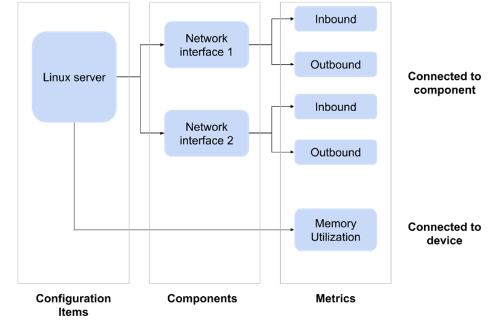
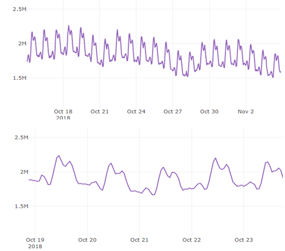
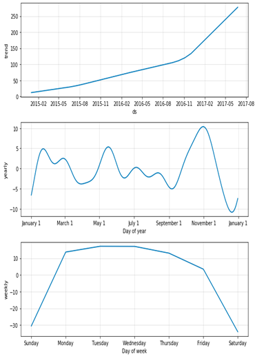

### Machine learning for monitoring data
#### Time series anomaly detection

---

## Hello


- Monitoring and Automation SW Dev Team @Cegeka:
    * Thomas Coomans
    * Stefan Bucur
    * Guang Wei
    * \+ many more that are not here
- We create software projects that enhance our monitoring tools
- Tripled the number of monitored devices => a need for AI/ML

Note:

Hello,
We are the the Software Development Team that is part of the
larger Monitoring and Automation Team in Cegeka.
In the last few years, the number of devices that we are monitoring
has almost tripled, and this fact brought with it a whole new set of challenges.
One of the solutions for these challenges is Machine Learning.

---

### Why is it this way?


Note:

This comic is on to something.
To make a software solution, you can usually describe at a high level what steps are needed.
But sometimes you don't know the steps at all.
Consider the following examples:
* finding if a photo is in a park
* finding if a picture is a bird
---

Finding if a photo is in a park

```python
1. Upload the picture
2. Find the latitude and longitude from EXIF data
3. Take a map of that area
4. If it's the right shade of green => it's a park

```

---

<iframe height="600" style="width: 100%;" scrolling="no" title="WmxBWz" src="//codepen.io/slbucur/embed/WmxBWz/?height=265&theme-id=0&default-tab=result" frameborder="no" allowtransparency="true" allowfullscreen="true">
  See the Pen <a href='https://codepen.io/slbucur/pen/WmxBWz/'>WmxBWz</a> by Stefan-Lucian Bucur
  (<a href='https://codepen.io/slbucur'>@slbucur</a>) on <a href='https://codepen.io'>CodePen</a>.
</iframe>


Note:

We implemented the solution ourselves. It took more than I would like to admit,
but because we knew the high level steps, it was mostly straight-forward.
---

Find if a picture is a bird

```python
1. Find the edges of the image
2. Find the basic shapes in it
3. If it has 3 triangles, it is probably a bird

```

Note:

I don't know about you, but I'm not very confident this is the right solution.

---


Note:

The steps mentioned above will probably find __some__ birds, but it would give a lot
of false positives and likely a lot of false negatives as well.

We can improve the algorithm by decomposing the image into smaller, more specific objects and basing our identification on them.

But you can probably guess this would be time consuming, and probably not very accurate either.

What's the solution?

Ideally we would make an algorithm that automatically learns how to find birds in
pictures, by training it with some manually labeled pictures.
Instead of programming with algorithms, we could program with data.
And that's what **machine learning** is :).

---

## Machine learning 101

---

Two main categories of ML:
- Supervised learning
- Unsupervised learning

---

@snap[north]
### Supervised learning
@snapend

Labeled data **=>** Create model **=>** Predict labels for data without labels

Note:

---

@snap[north]
Example
@snapend

<table style='font-size: 0.7em'>
  <tr>
    <th> Name </th>
    <th> Age </th>
    <th> Gender </th>
    <th> Ticket class </th>
    <th> Cabin number </th>
    <th> Survived </th>
  </tr>
  <tr>
    <td> Bill Smith </td>
    <td> 49 </td>
    <td> M </td>
    <td> 3rd </td>
    <td> 32C </td>
    <td> <b> No </b> </td>
  </tr>
  <tr>
    <td> Mandy Floyd </td>
    <td> 24 </td>
    <td> F </td>
    <td> 1st </td>
    <td> 2B </td>
    <td> <b> Yes </b> </td>
  </tr>
  <tr>
    <td> Carmen Floyd </td>
    <td> 22 </td>
    <td> F </td>
    <td> 1st </td>
    <td> 2D </td>
    <td> <b> Yes </b> </td>
  </tr>
</table>

---

What is the probability that Jack or Rose survived?
<table style='font-size: 0.7em'>
  <tr>
    <th> Name </th>
    <th> Age </th>
    <th> Gender </th>
    <th> Ticket class </th>
    <th> Cabin number </th>
    <th> Survived </th>
  </tr>
  <tr>
    <td> Jack Dawson </td>
    <td> 20 </td>
    <td> M </td>
    <td> 3rd </td>
    <td> 38D </td>
    <td> ? </td>
  </tr>
  <tr>
    <td> Rose DeWitt Bukater </td>
    <td> 17 </td>
    <td> F </td>
    <td> 1st </td>
    <td> 1A </td>
    <td> ? </td>
  </tr>
</table>

---


Note:

By using the extremely limited data set from the previous slide,
and our intuition, we notice two things:
* women and young people have a high survival rate (women and children first)
* passengers with better cabins also have a higher survival rate

From this we can conclude that James Cameron is a good statistician.

---

## Unsupervised learning

Trying to learn patterns in data, without having labels:
* clustering
* outlier detection
* data generation

---

### K-means

<iframe height="600" style="width: 100%;" scrolling="no" title="WmxBWz" src="https://slbucur.me/kmeans/" frameborder="no" allowtransparency="true" allowfullscreen="true">
</iframe>

<a href="http://web.stanford.edu/class/ee103/visualizations/kmeans/kmeans.html"> direct link <a>

Note:

K-means is a classic example of unsupervised learning.
If tries to find clusters in a data set, based on the distance between data items.
In this visualization, you can see the algorithm in practice for 2 dimensional points.
Since the algorithm is based on distance, you can use with a wide range of data types.
For example, you can group sentences together, with the distance between them
being the number of words they have in common.

---

### Monitoring data

---

We have two types of data:
* performance data
* events

Today we'll focus on performance data.

---

### Monitoring performance data

* metric or time series data
  * tuples of `(label, timestamp, value)`
* analyzes performance of hardware and software used throughout the data center
* easily displayed using line graphs

---


Note:

Network throughput graph represented by:
* inbound traffic: dark blue
* outbound traffic: light blue

---

### Our first use case for ML

* monthly availability reports generated by the networking team
* manually analysis of a subset of the network graphs:
  * sudden spikes or dips that could mean:
    * security breaches - rarely
    * incorrect device level configuration - often

---

* the number of devices tripled in the last few years
* manual analysis -> time consuming and error prone
* our task -> ** automate the anomaly detection process **

---

### Our approach

* proof of concept (POC) using a statistical model
* starting point for more complex models in the future.

---

### State of the art


* statistical models - unsupervised learning
* deep learning (neural networks) - supervised learning

---


### Statistical models

* a model is defined for the data
* one or multiple functions that depend on time
* the functions depend on multiple parameters (except time)
* to find them => we __train__ or __fit__ the model with our current data


---

Pros:
* fast
* easy to understand

Cons:
* cannot model complex data sets

---


Examples:
* STL decomposition - Seasonal Trend decomposition using Loess
* ARIMA – Auto Regressive Integrated Moving Average
* ETS decomposition – Error, Trend, Seasonality

---

### Deep learning models

* loosely imitate the human brain
* multiple linear models
  * one for each neuron in the network

---


Pros:
* can simulate very complex models

Cons:
* very slow time to train => more useful when having multiple metrics as inputs

---

### Data description

---

* Data coming from Zenoss
  * main monitoring tool 
  * monitors approximately **20.000** devices
* Device
  * unit required to run a service - ex. **linux server**
  * can be hardware or software - ex. **physical server** or **database server**
  * usually has multiple components - ex. **network interfaces**

---

* Metrics can be associated to components or devices
  * time series data
  * performance of a system - ex. **CPU** or **RAM** usage
  * stored in **OpenTSDB**

* Graphs
  * plot one or multiple metrics
  * useful for engineers

---



Note:
Example of metric data for a Linux server.

---

### Data summary

<table style="font-size:0.5em">
<tbody>
    <tr>
        <td width="141">
            <p><strong>Data Item</strong></p>
        </td>
        <td width="170">
            <p><strong>Count</strong></p>
        </td>
    </tr>
    <tr>
        <td width="141">
            <p>Devices</p>
        </td>
        <td width="170">
            <p>20.000</p>
        </td>
    </tr>
    <tr>
        <td width="141">
            <p>Components</p>
        </td>
        <td width="170">
            <p>1.300.000</p>
        </td>
    </tr>
    <tr>
        <td width="141">
            <p>Graph definitions</p>
        </td>
        <td width="170">
            <p>1.500.000</p>
        </td>
    </tr>
    <tr>
        <td width="141">
            <p>Metrics</p>
        </td>
        <td width="170">
            <p>3.000.000</p>
        </td>
    </tr>
</tbody>
</table>

---

### Time series anomaly detection

---

### What is an anomaly?

Anomalies can be defined in two ways:
* manually
* statistically

Note:
* Manually:
  * engineers manually label timestamps as anomalies
  * supervised learning
* Statistically
  * values are statistically different than the others
  * unsupervised learning

We don't have labeled data yet, as such we picked the statistical definition.
Using labeled data, we can improve our model.

---


Note:
Notice the anomalies in the orange rectangles.
They are usually larger than the other points.


---

### Seasonality

* not all spikes are anomalies
* most our data has a high degree of seasonality
  * high usage during the day and the week
  * low usage during the night and the weekend

Note:

The high seasonality is because our customers are located mostly in Europe.

---
### Seasonal spikes



Note:
The graph above shows the network usage of a device during the week.
Notice

* every 7 days, two have lower usage (Sunday and Saturday).

The graph below shows the network usage of a device during the day. 
Notice:

* much lower usage during the night.
* quite a dip in usage at lunch

---

### Facebook prophet

* library developed by facebook
* models time series data
* very good for highly seasonal data

Note:

We also tried other approaches like ARIMA and ETS, but they required manual tuning to generate a model.

---

### Forecasting model


`$$y(t) = g(t) + s(t) + h(t) + e(t)$$`


In this formula:
* `\(y(t)\)` - model output function
* `\(g(t)\)` - trend of the dataset
* `\(s(t)\)` - seasonality of the dataset
* `\(h(t)\)` - holidays
* `\(e(t)\)` - error

Note:

For our dataset we focus mainly on the trend and the seasonality.

---

### Model decomposition



---

### Anomaly detection model

`$$A_l(t) = \frac{min(Distance(M_u(t), D(t)), min(Distance(M_u(t), D(t)))}{factor * ( M_u(t) - M_l(t)}$$`


In this formula:
* `\(A_l(t)\)` - anomaly likelihood - real number between 0 and 1
* `\(D(t)\)` - the value of the timestamp in the original dataset
* `\(M_l(t)\)` - the Model lower bound
* `\(M_u(t)\)` - the Model upper bound
* `\Factor\)` - number multiplied with the difference between the upper and lower bounds
  * factor of two - anything with twice the distance => 100% anomaly likelihood

---


